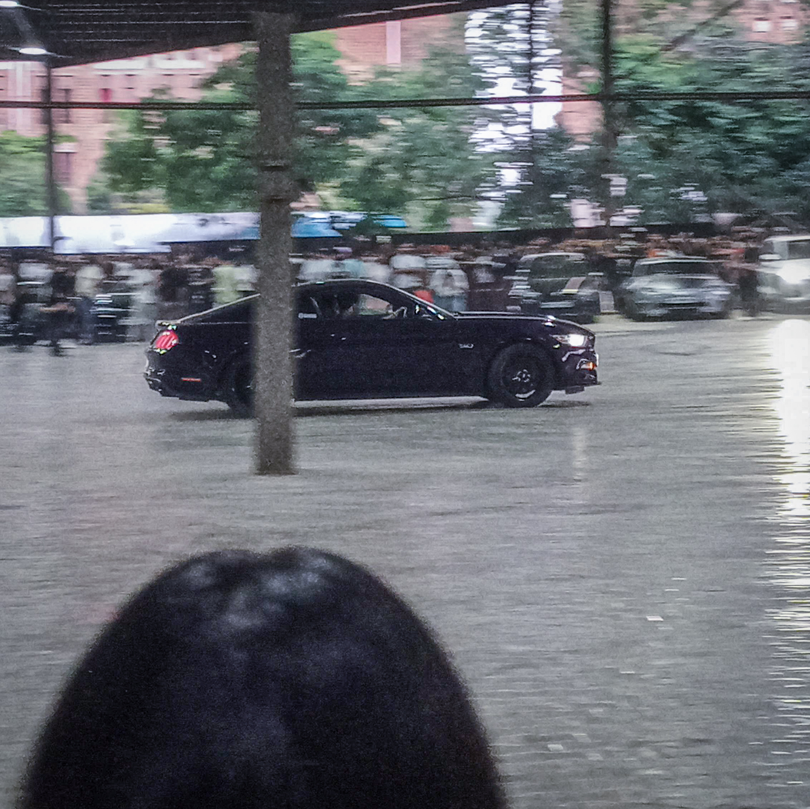

# 🚀 Internship Test Project

A modern web application built as part of an internship technical assessment to demonstrate **frontend development, clean UI design, reusable components, and scalable project structure**.

This project showcases practical development skills including:
- ⚡ Modern React / Next.js architecture
- 🎨 Clean and responsive UI
- 🧩 Reusable component-based design
- 📦 API integration / dynamic data handling
- 🛠️ Maintainable folder structure
- 📱 Mobile-first responsiveness

---

## 📌 Project Overview

The goal of this project is to demonstrate real-world frontend engineering practices expected in a professional internship role.

It focuses on:
- Writing clean and readable code
- Building scalable UI components
- Managing application state effectively
- Structuring files for long-term maintainability
- Delivering polished user experience

---

## 🛠️ Tech Stack

- **Framework:** Next.js
- **Library:** React.js
- **Language:** JavaScript
- **Styling:** CSS / Tailwind CSS
- **State Management:** React Hooks
- **Deployment:** Vercel
- **Version Control:** Git + GitHub

---

## 📂 Folder Structure

```bash
Internship-Test/
│── app/
│── components/
│── public/
│── styles/
│── utils/
│── package.json
│── README.md
```

---

## ⚙️ Installation & Setup

Clone the repository:

```bash
git clone https://github.com/Purujeet-git/Internship-Test.git
```

Move into the project folder:

```bash
cd Internship-Test
```

Install dependencies:

```bash
npm install
```

Run the development server:

```bash
npm run dev
```

Open in browser:

```bash
http://localhost:3000
```

---

## ✨ Features

- ✅ Responsive UI design
- ✅ Clean reusable components
- ✅ Dynamic rendering
- ✅ API/data integration
- ✅ User-friendly layout
- ✅ Optimized project structure
- ✅ Production-ready code practices

---

## 🎯 What This Project Demonstrates

This project highlights my ability to:

- Build production-ready frontend applications
- Follow clean coding practices
- Write reusable React components
- Structure scalable Next.js apps
- Create responsive user experiences
- Deliver internship-level assignments professionally

---

## 📸 Screenshots

Add screenshots here for better presentation.

Example:

```md

```

---

## 🚀 Deployment

Live Demo: **Add your deployed Vercel link here**

Example:

```md[(https://internship-test-gamma.vercel.app/)]

```

---

## 👨‍💻 Author

**Purujeet Kumar**

- GitHub: https://github.com/Purujeet-git
- LinkedIn: https://www.linkedin.com/in/purujeet-kumar-2b9bb6321/
---

## 📄 License

This project is created for internship assessment and educational purposes.
